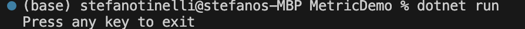
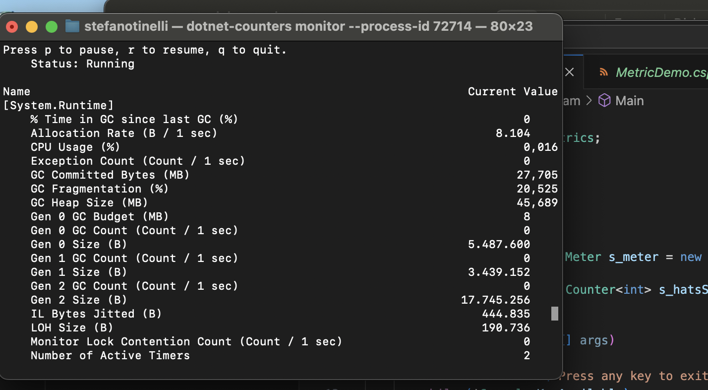

## Tecnologias Utilizadas

- **.NET 6**: Plataforma de desenvolvimento para construção de aplicações.
- **C#**: Linguagem de programação utilizada para desenvolver a aplicação.
- **System.Diagnostics.Metrics**: Biblioteca do .NET para criação e monitoramento de métricas.
- **dotnet-counters**: Ferramenta CLI para monitorar métricas em tempo real.

## Conceitos Aprendidos

- **Criação de Métricas**: criar e registrar métricas usando a biblioteca `System.Diagnostics.Metrics`.
- **Monitoramento de Métricas**: ferramenta `dotnet-counters` para monitorar as métricas em tempo real.
- **Uso de Counters**: como usar diferentes tipos de contadores para medir dados específicos, como vendas de itens.


## Setup do Projeto

### Comandos do CLI Utilizados

1. **Criação de Aplicativo Console**
   ```bash
   dotnet new console -n MetricDemo
   ```
2. **Adição de Pacote NuGet**
   ```bash
   dotnet add package System.Diagnostics.DiagnosticSource --version 8.0.0
   ```
3. **Execução da Aplicação**
   ```bash
   dotnet run
   ```
4. **Instalação de Ferramenta de Monitoramento**
   ```bash
   dotnet tool install --global dotnet-counters
   ```
5. **Monitoramento das Métricas**
   ```bash
   dotnet-counters monitor --process-id <PID> --counters "HatCo.Store"
   ```

## Implementação

Abaixo está o código utilizado para criar e registrar a métrica de chapéus vendidos:

```csharp
using System;
using System.Diagnostics.Metrics;
using System.Threading;

class Program
{
    private static readonly Meter s_meter = new Meter("HatCo.Store");
    private static readonly Counter<int> s_hatsSold = s_meter.CreateCounter<int>("hats_sold");

    static void Main(string[] args)
    {
        Console.WriteLine("Press any key to exit");
        while (!Console.KeyAvailable)
        {
            Thread.Sleep(1000);  // Simula uma venda a cada segundo
            s_hatsSold.Add(4);   // Cada venda vende 4 chapéus
        }
    }
}
```

## Execução e Monitoramento

Executamos a aplicação utilizando `dotnet run` e monitoramos as métricas com `dotnet-counters`.

## Screenshots do Funcionamento

Aqui estão os prints demonstrando a execução e o monitoramento das métricas da aplicação:

- **Início da Aplicação**
  

- **Monitoramento das Métricas**
  

## Conclusão

Este projeto demonstrou como é possível implementar e monitorar métricas personalizadas em uma aplicação .NET, fornecendo insights valiosos sobre o comportamento da aplicação em tempo real.

## Como Contribuir

Contribuições para o projeto são bem-vindas. Seguem os passos para contribuir:

1. Faça um fork do repositório.
2. Crie uma nova branch para suas modificações.
3. Envie suas modificações para avaliação.
4. Solicite um pull request para a branch principal do projeto.
```

Esta versão da documentação agora inclui uma seção detalhada de comandos CLI utilizados, além de uma representação clara do código desenvolvido para o projeto. As imagens e seus espaços reservados foram mantidos como especificado inicialmente.