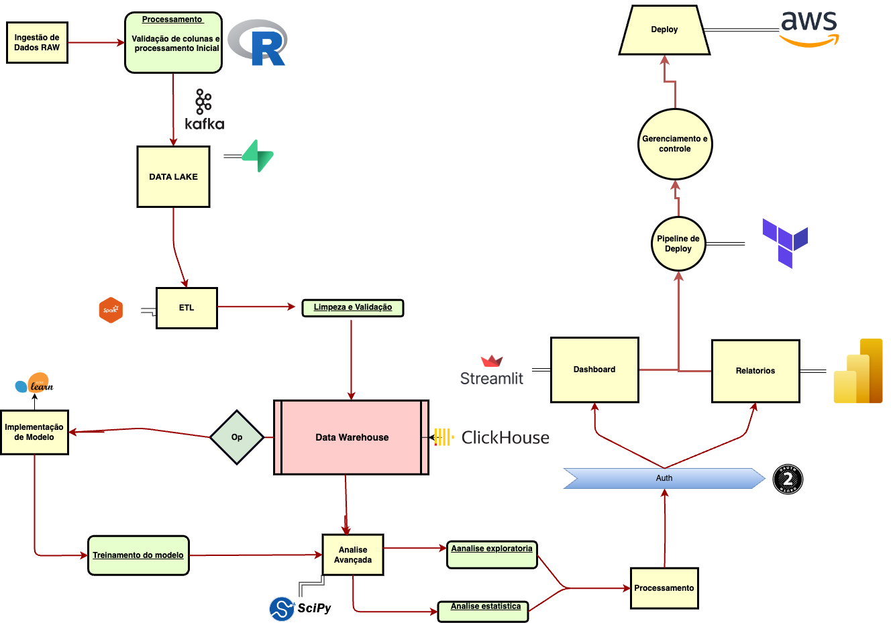

Esta arquitetura descreve o fluxo de dados, processamento, armazenamento, segurança, análise e visualização no DataApp, desenvolvido para otimizar a análise de dados e a tomada de decisões em uma organização.

## 1. Ingestão de Dados

### **Ingestão de Dados RAW**
A primeira etapa do processo é a **Ingestão de Dados RAW**, onde os dados brutos são coletados de várias fontes e inseridos no sistema para processamento posterior. Esses dados podem incluir transações, logs, e outras formas de dados não estruturados que serão processados em etapas subsequentes.

## 2. Processamento de Dados

### **Validação de Colunas e Processamento Inicial**
Após a ingestão, os dados passam por uma **Validação de Colunas e Processamento Inicial**. Utilizando a linguagem **R**, esta fase garante que os dados estejam estruturados corretamente, identificando e corrigindo problemas antes de prosseguir. Este processamento inicial também pode incluir a normalização de dados e a remoção de duplicatas.

### **Envio para o Data Lake via Kafka**
Uma vez processados, os dados são enviados para o **Data Lake**. O **Apache Kafka** é utilizado para gerenciar o fluxo de dados, proporcionando alta disponibilidade e consistência durante a transmissão. O Data Lake atua como um repositório centralizado para armazenar dados em seu estado bruto, permitindo fácil acesso para análises e transformações subsequentes.

### **ETL (Extract, Transform, Load)**
Dentro do Data Lake, os dados brutos são submetidos a um processo de **ETL (Extract, Transform, Load)**. Utilizando o **Apache Spark**, os dados são extraídos, transformados e carregados no **Data Warehouse**. Durante essa fase, as ferramentas de ETL garantem que os dados sejam limpos, estruturados, e otimizados para consultas analíticas. O **Apache Nifi** é integrado para facilitar o gerenciamento e automação dos fluxos de dados entre diferentes sistemas.

## 3. Armazenamento de Dados

### **Limpeza e Validação Adicional**
Antes de serem armazenados definitivamente no Data Warehouse, os dados passam por uma **Limpeza e Validação Adicional**. Esta etapa assegura que os dados estão prontos para análises avançadas e uso em produção. As regras de qualidade são aplicadas rigorosamente para garantir a integridade e a confiabilidade dos dados armazenados.

### **Encriptação dos Dados**
Para garantir a segurança, os dados passam por um processo de **Encriptação** antes de serem armazenados no **Data Warehouse**. Isso protege os dados em repouso, cumprindo com regulamentações de proteção de dados e prevenindo acessos não autorizados.

### **Armazenamento no Data Warehouse (ClickHouse)**
Os dados validados e encriptados são então armazenados no **Data Warehouse** utilizando o **ClickHouse**. Este banco de dados colunar é altamente eficiente para processamento de grandes volumes de dados, oferecendo suporte rápido e escalável para análises complexas e consultas em tempo real.

## 4. Análise e Modelagem

### **Desencriptação e Análise Avançada**
Os dados armazenados no Data Warehouse são desencriptados conforme necessário para **Análise Avançada**. **SciPy** é empregado para realizar análises estatísticas e execuções de algoritmos matemáticos avançados, permitindo a geração de insights detalhados e previsões precisas.

### **Treinamento de Modelos**
Os dados disponíveis também são utilizados para **Treinamento de Modelos Preditivos**. Com o uso de **Scikit-learn**, modelos preditivos são desenvolvidos e implementados para antecipar tendências e apoiar a tomada de decisões estratégicas.

## 5. Visualização e Relatórios

### **Dashboards Interativos (Streamlit)**
Os resultados das análises são apresentados através de **Dashboards Interativos** criados com **Streamlit**. Esta ferramenta permite a criação de interfaces dinâmicas que facilitam a exploração dos dados e a visualização dos resultados em tempo real, sendo essencial para monitoramento contínuo e avaliações rápidas.

### **Relatórios Detalhados (Power BI)**
Além dos dashboards, relatórios detalhados são gerados utilizando **Power BI**. Esses relatórios consolidam as informações e as apresentam de maneira compreensível para os usuários finais, oferecendo insights acionáveis e facilitando a comunicação entre diferentes níveis da organização.

## 6. Deploy e Infraestrutura

### **Pipeline de Deploy Automatizado**
A infraestrutura para o DataApp é gerenciada através de um **Pipeline de Deploy** automatizado, construído com **Terraform**. Este pipeline lida com a criação e o gerenciamento de recursos na **AWS**, garantindo consistência e permitindo que as atualizações sejam facilmente implementadas.

### **Gerenciamento e Controle Contínuos**
O deploy das aplicações, incluindo os dashboards e relatórios, é realizado na **AWS**. O **Gerenciamento e Controle Contínuos** do ambiente asseguram que o sistema funcione conforme o esperado, com monitoramento, manutenção e atualizações regulares. Isso inclui a utilização de containers Docker para garantir que as aplicações sejam portáveis e possam ser executadas em qualquer ambiente com consistência.

### **Autenticação e Controle de Acesso**
O acesso ao sistema é protegido por **Autenticação** robusta, garantindo que somente usuários autorizados possam acessar dados sensíveis e realizar operações críticas. As políticas de controle de acesso são aplicadas para garantir que os dados e processos estejam protegidos contra acessos não autorizados.

## Conclusão

Esta arquitetura foi desenhada para ser robusta, modular e escalável, proporcionando um fluxo eficiente de dados desde a ingestão até a análise e visualização. O uso das tecnologias como **Kafka**, **Spark**, **ClickHouse**, e **Terraform** oferece um ambiente otimizado para análises avançadas, garantindo segurança e performance em todas as etapas do processo. A abordagem centrada em dashboards interativos e relatórios detalhados facilita a tomada de decisões informadas, aumentando a eficácia e agilidade da organização.

