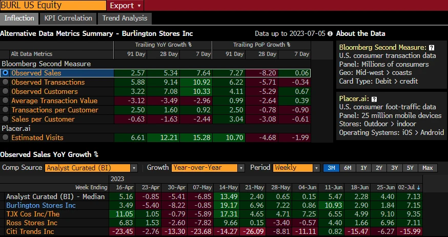

### Análise de Caso: Dashboard de Métricas de Dados Alternativos (BloomBerg) - Burlington Stores Inc.

#### Descrição do Problema e Seu Contexto
O problema abordado neste dashboard está relacionado à análise de desempenho de vendas e métricas relacionadas para a Burlington Stores Inc., uma cadeia de lojas de departamentos dos EUA. O contexto é a necessidade de compreender rapidamente as tendências de vendas, comportamento do cliente, e outras métricas operacionais para apoiar decisões estratégicas. No setor de varejo, a capacidade de monitorar e responder rapidamente às mudanças nas métricas de desempenho é crucial para a competitividade e sucesso a longo prazo.

#### Descrição da Solução
O dashboard é uma ferramenta de análise de métricas de dados alternativos, permitindo que os analistas observem várias métricas críticas relacionadas ao desempenho da Burlington Stores Inc. A solução apresentada inclui várias seções:

- **Métricas Alternativas de Dados:** Esta seção apresenta uma variedade de métricas, como Vendas Observadas, Transações Observadas, Clientes Observados, Valor Médio das Transações, entre outras. Essas métricas são comparadas ao longo de diferentes períodos (91 dias, 28 dias, 7 dias) e apresentam o crescimento percentual, tanto ano sobre ano (YoY) quanto período sobre período (PoP).

- **Bloomberg Second Measure:** Fornece dados detalhados de transações dos consumidores dos EUA, divididos por regiões geográficas e tipos de cartões usados (débito/crédito). Isso permite uma análise granular das tendências de consumo.

- **Placer.ai:** Oferece dados sobre o tráfego de consumidores em lojas físicas, obtidos através de dispositivos móveis. Isso ajuda a correlacionar o tráfego de clientes com as métricas de vendas.

- **Crescimento de Vendas Observadas YoY:** Nesta seção, é possível ver uma comparação das métricas de crescimento das vendas ano sobre ano entre a Burlington Stores Inc. e seus concorrentes, como TJX Cos Inc. e Ross Stores Inc. A tabela também permite a análise por semana, oferecendo uma visão detalhada das flutuações semanais.

#### Por Que a Solução Funciona
A solução funciona por diversas razões:

- **Integração de Dados Alternativos:** O dashboard combina várias fontes de dados alternativos, como transações de consumidores e dados de tráfego de lojas, proporcionando uma visão abrangente do desempenho da Burlington Stores Inc. Isso permite aos gestores compreenderem não apenas o que está acontecendo em termos de vendas, mas também o comportamento subjacente dos consumidores.

- **Visualização Clara e Comparativa:** A utilização de cores e tabelas facilita a comparação das métricas ao longo do tempo e entre concorrentes. As cores verde e vermelho destacam crescimentos e declínios, permitindo uma análise visual rápida e eficaz.

- **Atualização em Tempo Real:** Como os dados são apresentados em períodos curtos (91, 28, e 7 dias), o dashboard parece ser atualizado regularmente, permitindo que os tomadores de decisão atuem com base em informações recentes.

- **Foco em Métricas Relevantes:** As métricas selecionadas, como o valor médio das transações e o número de clientes observados, são diretamente relevantes para entender a saúde financeira da empresa e a eficácia das suas estratégias de mercado.

#### Aspectos Técnicos do Dashboard
Agora, vamos aprofundar na análise técnica do dashboard:

- **Tipo de Dashboard:** Este é um exemplo de **dashboard analítico**. Diferente de dashboards operacionais, que são usados para monitoramento em tempo real de operações cotidianas, o dashboard analítico foca na agregação e visualização de dados históricos e complexos, permitindo insights estratégicos e comparativos ao longo de períodos variados. Ele é projetado para analistas e gestores que precisam tomar decisões baseadas em tendências e padrões de dados.

- **Fontes de Dados:** O dashboard integra múltiplas fontes de dados, incluindo transações de consumidores e tráfego de lojas físicas, provavelmente utilizando APIs para acessar os dados de fontes como Bloomberg Second Measure e Placer.ai. Esse tipo de integração sugere o uso de pipelines de dados que consolidam informações em tempo real e agregam-nas para visualização em diferentes granularidades temporais.

- **Tecnologias Subjacentes:** O Dashboard foi contruido com o **Bloomberg Terminal**, que oferece visualização de dados financeiros e corporativos em tempo real. Outras tecnologias que podem estar envolvidas incluem bancos de dados relacionais e sistemas de ETL (Extract, Transform, Load) que permitem a preparação e integração de dados para análise.

- **Visualizações Utilizadas:** O dashboard faz uso extensivo de tabelas de dados color-coded, uma técnica que melhora a legibilidade e facilita a identificação de padrões positivos e negativos. A coloração verde e vermelha para crescimento e declínio, respectivamente, é uma prática comum em visualizações financeiras para destacar variações de desempenho.

- **Interface de Exportação:** O botão de "Export" sugere que os usuários podem exportar os dados visualizados em diferentes formatos, como CSV ou Excel, para análise adicional ou para compartilhamento com outras partes interessadas. Essa funcionalidade é crucial em ambientes corporativos, onde a colaboração e a documentação de decisões baseadas em dados são essenciais.

#### Potenciais Limitações
Embora o dashboard seja poderoso, ele possui algumas limitações:

- **Complexidade de Interpretação:** Para analistas que não estão familiarizados com as métricas ou os métodos de coleta de dados, o dashboard pode ser difícil de interpretar corretamente. Isso pode levar a decisões mal-informadas se as métricas forem mal compreendidas.

- **Dependência de Dados Externos:** Como o dashboard depende de fontes externas de dados, como o Placer.ai e o Bloomberg Second Measure, a precisão e a integridade das análises dependem da qualidade dos dados fornecidos por essas plataformas.

- **Foco em Curto Prazo:** O dashboard se concentra em comparações de curto prazo (7, 28, 91 dias), o que pode ser insuficiente para análises de tendências de longo prazo. Embora útil para reações rápidas, pode não fornecer uma visão estratégica de longo prazo.

#### Conclusão
Este dashboard é uma ferramenta altamente eficaz para monitorar e analisar o desempenho da Burlington Stores Inc. em tempo real. Ele integra múltiplas fontes de dados para fornecer uma visão completa e acionável das operações e do comportamento do consumidor. No entanto, a complexidade da interpretação e a dependência de dados de terceiros são fatores que os usuários devem considerar ao utilizar este dashboard para a tomada de decisões. Em última análise, sua eficácia reside na capacidade de transformar grandes volumes de dados em insights acionáveis, mas deve ser usado com uma compreensão clara de suas limitações e do contexto mais amplo.

### Estratégias de Evolução com DesignOps e Design System

#### 1. Implementação de Componentes Atômicos para Melhorar a Consistência Visual

**Descrição:** A abordagem de Design Atômico, proposta por Brad Frost, sugere a decomposição de interfaces em seus componentes mais básicos, chamados de "átomos", que podem ser combinados para formar moléculas e organismos, e eventualmente templates e páginas completas. Aplicar essa metodologia ao dashboard da Burlington Stores Inc. significa criar uma biblioteca de componentes reutilizáveis, como botões, gráficos, tabelas e layouts de página.

**Justificativa:** Ao implementar uma biblioteca de componentes atômicos, a equipe de design pode garantir consistência visual e funcional em todas as partes do dashboard. Isso não só melhora a experiência do usuário, tornando a interface mais intuitiva e previsível, mas também acelera o processo de desenvolvimento, permitindo que novos elementos sejam adicionados sem a necessidade de recriar estilos e interações do zero. Além disso, facilita a manutenção e atualização do sistema, já que mudanças em um componente atômico são refletidas em todas as instâncias onde ele é usado.

#### 2. Criação de um Design System para Escalabilidade e Governança

**Descrição:** Um Design System é uma coleção de padrões, componentes e diretrizes que unificam o design e desenvolvimento de produtos. Para o dashboard em questão, seria benéfico criar um Design System que inclua não apenas os componentes gráficos, mas também as diretrizes de uso, documentação e boas práticas de acessibilidade.

**Justificativa:** Um Design System robusto permitiria à equipe escalar o dashboard para incluir novos recursos e dados sem comprometer a consistência ou a usabilidade. Ele também facilita a colaboração entre designers, desenvolvedores e stakeholders, garantindo que todos estejam alinhados quanto às diretrizes e padrões estabelecidos. Além disso, a governança do Design System ajuda a garantir que novas adições ao dashboard sejam feitas de maneira controlada e conforme os princípios estabelecidos, evitando a fragmentação visual ou funcional da interface.

#### 3. Integração de Processos de DesignOps para Otimização do Workflow

**Descrição:** DesignOps refere-se à prática de otimizar e operacionalizar os processos de design, de forma que eles sejam integrados eficientemente ao ciclo de desenvolvimento e lançamento de produtos. No caso do dashboard, a adoção de DesignOps envolveria a padronização de ferramentas, a automação de tarefas repetitivas e a criação de um pipeline de feedback contínuo entre designers, desenvolvedores e usuários finais.

**Justificativa:** A implementação de DesignOps pode significativamente melhorar a eficiência do desenvolvimento do dashboard, reduzindo o tempo entre o design e a implementação, e garantindo que as alterações sejam testadas e validadas rapidamente. Isso resulta em um ciclo de iteração mais rápido, permitindo que melhorias de UX sejam implementadas continuamente com base em dados reais de uso. DesignOps também promove uma cultura de colaboração e comunicação, essencial para o sucesso de produtos complexos como dashboards.

