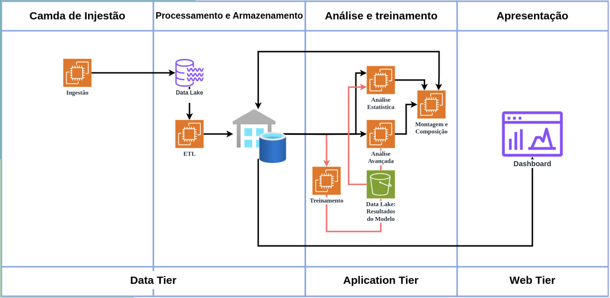

# Documentação de Arquitetura e Precificação na Nuvem

Este documento visa apresentar a arquitetura proposta para um sistema na nuvem, detalhando os custos envolvidos utilizando a Calculadora de Preços da AWS, e oferecendo uma análise completa através de uma planilha Excel. Além disso, a fidelidade entre a arquitetura visual e a precificação estimada será destacada.

## Arquitetura Proposta

A arquitetura do sistema foi desenhada para abranger quatro camadas principais: **Ingestão**, **Processamento e Armazenamento**, **Análise e Treinamento**, e **Apresentação**. O diagrama abaixo foi criado utilizando o draw.io e representa visualmente como os serviços da AWS foram integrados para construir esta solução.

### Descrição da Arquitetura

1. **Camada de Ingestão:**
   - **Serviço Utilizado:** Amazon EC2
   - **Descrição:** Responsável por capturar e processar os dados que entram no sistema. Instâncias EC2 são configuradas para lidar com a carga de trabalho de ingestão de dados.

2. **Camada de Processamento e Armazenamento:**
   - **Serviços Utilizados:** Amazon EC2, Amazon S3
   - **Descrição:** Após a ingestão, os dados são processados por instâncias EC2 e armazenados no Amazon S3 para posterior análise.

3. **Camada de Análise e Treinamento:**
   - **Serviço Utilizado:** AWS IAM Access Analyzer
   - **Descrição:** Nesta camada, ocorre a análise dos dados armazenados, bem como o treinamento de modelos preditivos. O AWS IAM Access Analyzer é utilizado para monitorar e controlar o acesso a esses dados.

4. **Camada de Apresentação:**
   - **Serviço Utilizado:** Dashboard integrado (por meio de AWS QuickSight ou similar)
   - **Descrição:** A visualização dos resultados e insights é feita através de um dashboard, que apresenta os dados processados de forma clara e intuitiva.

## Precificação e Custos

A estimativa de custos foi feita utilizando a Calculadora de Preços da AWS, levando em consideração todos os serviços detalhados na arquitetura acima.

### Estimativa de Custos

Abaixo está o resumo dos custos calculados para os serviços incluídos na arquitetura.

- **Custo Inicial:** 0,00 USD
- **Custo Mensal:** 12,80 USD
- **Custo Total para 12 Meses:** 153,60 USD

Os principais componentes de custo incluem instâncias EC2, armazenamento no S3, e o IAM Access Analyzer. Cada um destes serviços foi configurado considerando o melhor custo-benefício, como demonstrado na planilha de custos.

### Planilha de Precificação

Uma planilha Excel foi desenvolvida para detalhar os custos de cada serviço e comparar diferentes opções de configuração.

- **Resumo dos Custos:** Organizado por serviço, região, e tipo de custo.

## Conclusão

A documentação apresentada demonstra a conexão entre a arquitetura proposta e os custos estimados. A utilização da Calculadora de Preços da AWS foi otimizada para garantir uma estimativa precisa e eficiente. Além disso, a planilha Excel fornece uma análise detalhada e visual dos custos, permitindo uma avaliação aprofundada do projeto.

Toda a arquitetura visual e planilha de custos estão disponíveis nas imagens acima, garantindo que cada aspecto do projeto esteja documentado de forma clara e precisa.

-