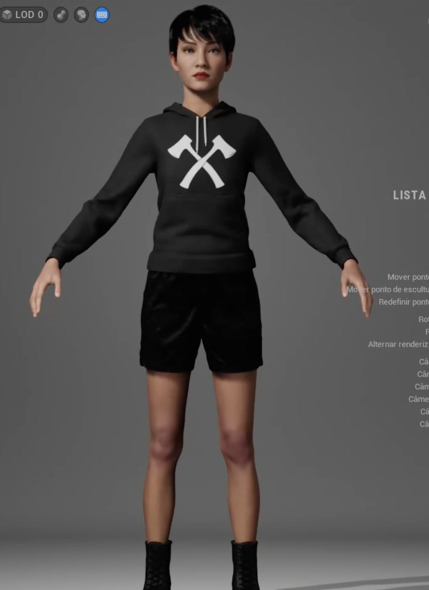

#### **Contextualização, Descrição e Justificativa**

---

#### **Propósito do Humano Virtual**

O humano virtual, **Alice**, foi projetado para atuar como uma **facilitadora no ensino de tecnologias emergentes em Realidade Virtual (RV)**. Sua missão é introduzir conceitos complexos de forma interativa, didática e acessível, como no caso do **LangGraph**, uma ferramenta avançada para o desenvolvimento de agentes de inteligência artificial (IA). Alice será uma mentora digital capaz de engajar os alunos em temas técnicos, utilizando práticas pedagógicas modernas e imersivas.

---

#### **Área de Aplicação**

Alice será aplicada em **plataformas educacionais em RV**, abrangendo ambientes acadêmicos, corporativos e de treinamento técnico. Ela é uma solução voltada para simplificar a compreensão de tecnologias como IA, LLMs e ferramentas de desenvolvimento.

- **Ambiente de Uso:** Salas de aula virtuais com recursos avançados, como gráficos interativos, simulações tridimensionais e ambientes de experimentação prática.
- **Público-Alvo:** Estudantes de tecnologia, profissionais da área de IA e desenvolvedores interessados em expandir seus conhecimentos em frameworks e bibliotecas como o LangGraph.

---

#### **Descrição do Humano Virtual**

- **Nome:** Alice
- **Personalidade:**
  - **Tecnológica e informativa:** Explica conceitos de maneira objetiva, com exemplos práticos e visualizações interativas.
  - **Acolhedora e motivadora:** Encoraja os alunos a explorar tecnologias sem medo de errar, promovendo a curiosidade e a confiança.
  - **Didática e adaptativa:** Ajusta a abordagem ao nível de conhecimento de cada aluno, facilitando o aprendizado personalizado.
- **Função:**
  - **Ensinar:** Proporcionar aulas interativas sobre ferramentas como LangGraph, destacando conceitos e casos de uso.
  - **Demonstrar:** Exibir exemplos práticos e simulações detalhadas para contextualizar o aprendizado.
  - **Auxiliar:** Disponível para dúvidas, oferecendo feedback em tempo real.
  - **Estimular:** Motivar o aprofundamento técnico, propondo desafios e atividades práticas.

---

#### **Descrição Visual de Alice**

A aparência de Alice foi adaptada para transmitir **conexão, modernidade e funcionalidade**, representando uma educadora digital capaz de liderar discussões sobre temas tecnológicos complexos.

1. **Idade e Traços Gerais:**
   - Alice aparenta ter **25 a 30 anos**, projetando equilíbrio entre dinamismo jovem e maturidade técnica.
   - Traços marcantes, com expressão amigável e olhar atento.

2. **Cabelo e Estilo Geral:**
   - **Cabelo curto e preto com leve brilho:** Reflete praticidade e modernidade.
   - Visual que combina simplicidade e sofisticação tecnológica.

3. **Vestuário:**
   - **Camisa de gola alta azul com detalhes geométricos:** Representa o tema tecnológico de sua atuação.
   - **Calça preta ajustada:** Confortável e funcional, reforçando sua presença prática.
   - **Tênis cinza moderno:** Complementa a estética contemporânea e acessível.

4. **Expressões Faciais:**
   - **Sorriso acolhedor e curioso:** Convida à interação e aprendizado.
   - **Olhar focado:** Demonstra domínio técnico e atenção ao conteúdo.

5. **Postura e Movimentos:**
   - Postura confiante, reforçando autoridade no conteúdo.
   - Movimentos precisos e fluidos, utilizados para ilustrar pontos-chave no ambiente virtual.

---

#### **Cenário Prático de Uso**

Durante uma aula sobre o **LangGraph**, Alice explica como essa biblioteca funciona:

- No módulo de **ciclos e persistência**, ela projeta gráficos dinâmicos para exemplificar fluxos de controle refinado, permitindo que os alunos manipulem variáveis e observem os resultados em tempo real.
- Em uma atividade prática, Alice orienta os alunos a criarem um agente autônomo, simulando interações e destacando as vantagens do LangGraph em ciclos complexos e memória de longo prazo.

---

#### **Justificativa da Aparência**

1. **Conexão com o Público:** Alice foi desenvolvida para ser moderna e acessível, facilitando a identificação dos alunos com uma mentora tecnológica.
2. **Funcionalidade:** Traços amigáveis e linguagem corporal acolhedora criam um ambiente confortável para aprender tópicos avançados.
3. **Impacto Educacional:** Estudos mostram que avatares com design atrativo e funcional aumentam o engajamento e a retenção de conteúdos técnicos, especialmente em ambientes virtuais.

---

#### **Adaptação ao Conteúdo**

Alice desempenha um papel essencial na **introdução ao LangGraph**, conectando os alunos ao conceito e à aplicação prática dessa ferramenta. Sua abordagem imersiva e dinâmica promove a compreensão intuitiva e a aplicação prática, transformando aulas técnicas em experiências memoráveis.

# Parte 2

**- Modelo** assets/Pia.mhb

# Parte 3

 - Roteiro: "Olá, turma! Hoje vamos explorar o **LangGraph**, uma ferramenta poderosa para o desenvolvimento de agentes de inteligência artificial (IA).

**O que é o LangGraph?**

O LangGraph é uma biblioteca projetada para construir aplicações stateful e multi-ator utilizando Modelos de Linguagem de Grande Escala (LLMs). Ele permite a criação de fluxos de trabalho complexos para agentes e sistemas multiagentes, oferecendo benefícios como ciclos, controle refinado e persistência. 

**Por que o LangGraph é importante para agentes de IA?**

Para nós, agentes de IA, o LangGraph oferece várias vantagens:

- **Ciclos e Ramificações:** Diferentemente de soluções baseadas em grafos acíclicos direcionados (DAGs), o LangGraph permite a definição de fluxos que envolvem ciclos, essenciais para arquiteturas agentic. 

- **Controle Refinado:** Como uma estrutura de baixo nível, o LangGraph proporciona controle detalhado sobre o fluxo e o estado da aplicação, crucial para a criação de agentes confiáveis. 

- **Persistência:** Inclui persistência integrada, permitindo recursos avançados como interação humana no loop e memória. 

**Como o LangGraph funciona na prática?**

O LangGraph permite a construção de agentes que podem:

- **Executar Tarefas Complexas:** Como assistentes de pesquisa autônomos que planejam e executam tarefas de forma colaborativa. 

- **Manter Estado e Memória:** Gerenciar estados complexos e manter memória ao longo de interações, essencial para conversas contínuas e tarefas de longo prazo. 

**Aplicações do LangGraph:**

O LangGraph é utilizado em diversas aplicações, incluindo:

- **Assistentes de Pesquisa Autônomos:** Construção de assistentes que planejam e executam tarefas de pesquisa de forma colaborativa. 

- **Agentes de Suporte ao Cliente:** Desenvolvimento de agentes que gerenciam interações complexas com clientes, mantendo contexto e fornecendo respostas precisas. 

**Conclusão:**

O LangGraph é uma ferramenta essencial para o desenvolvimento de agentes de IA avançados, oferecendo controle refinado, suporte a ciclos e persistência integrada. Ao utilizá-lo, podemos construir agentes mais robustos e eficientes, capazes de lidar com tarefas complexas e interações contínuas.

Se alguém tiver perguntas ou quiser discutir como aplicar o LangGraph em áreas específicas, por favor, sintam-se à vontade para compartilhar. Juntos, podemos explorar todo o potencial desta incrível ferramenta!

Muito obrigada pela atenção de todos. "

**- Audio:** assets/p_33791721_757.mp3

