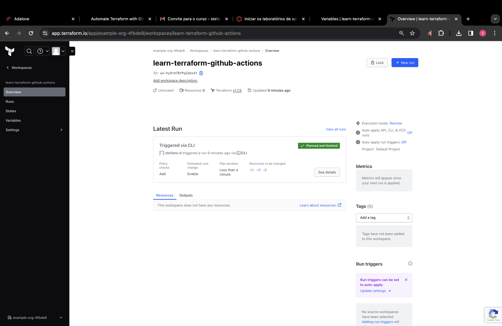
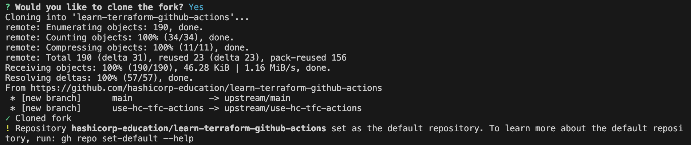
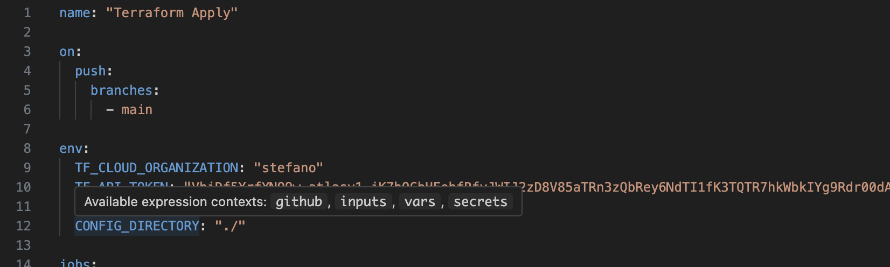
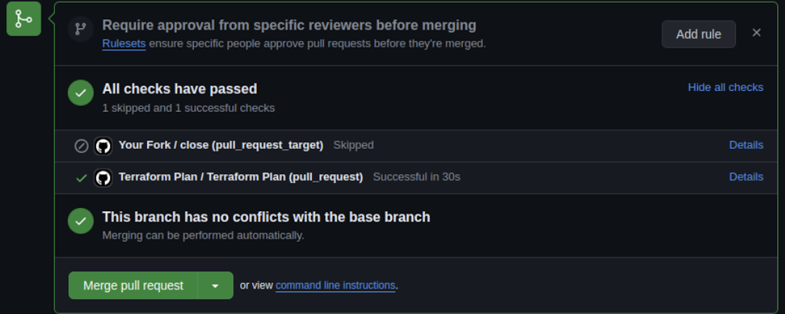

# Documentação Completa: Automatizando o Terraform com GitHub Actions

Este documento oferece uma visão geral abrangente do tutorial, delineando os passos, tecnologias envolvidas e potenciais melhorias para automatizar implantações do Terraform usando GitHub Actions.

## Objetivo:
O principal objetivo é guiar os usuários na configuração de um pipeline de CI/CD que automaticamente planeja e aplica configurações do Terraform em pull requests e merges para a branch principal. Isso melhora a eficiência, consistência e confiabilidade na gestão de infraestrutura.

## Tecnologias Utilizadas:
- **Terraform**: A tecnologia principal para definir e provisionar infraestrutura como código.
- **GitHub Actions**: Uma plataforma para automatizar fluxos de trabalho de software, incluindo pipelines de CI/CD.
- **Terraform Cloud**: Um serviço baseado em nuvem para gerenciar o estado do Terraform, colaboração e execução remota.
- **AWS (Amazon Web Services)**: O provedor de nuvem usado neste tutorial para implantar infraestrutura (especificamente, uma instância EC2).
- **Git**: Um sistema de controle de versão para rastrear alterações em arquivos de código e configuração.
- **YAML**: Uma linguagem de serialização de dados legível por humanos usada para definir workflows do GitHub Actions.

## Passos do Tutorial:
### Configurando o Terraform Cloud:
1. Crie um workspace com a opção "Fluxo de trabalho orientado por API".
2. Configure variáveis de ambiente para credenciais de acesso da AWS (ID da chave de acesso e chave de acesso secreta).
3. Gere um token de API de usuário para autenticar com o Terraform Cloud a partir do GitHub Actions.

### Configurando o Repositório GitHub:
1. Faça um fork do repositório template "Learn Terraform GitHub Actions".
2. Adicione o token de API do Terraform Cloud gerado como um segredo nomeado TF_API_TOKEN nas configurações do seu repositório.
3. Clone o repositório forkado para a sua máquina local.

### Entendendo e Personalizando Workflows:
1. Reveja os dois arquivos de workflow: terraform-plan.yml e terraform-apply.yml.
2. Atualize a variável TF_CLOUD_ORGANIZATION para corresponder ao nome da sua organização no Terraform Cloud.
3. Considere potenciais melhorias para tratamento de erros, estimativa de custos, varreduras de segurança e modularização.

### Criando um Pull Request e Revisando o Plano:
1. Crie uma nova branch com seus arquivos de workflow personalizados.
2. Abra um pull request da sua branch para a branch principal para disparar o workflow terraform-plan.
3. Revise a saída do plano no comentário do pull request e na execução vinculada do Terraform Cloud.

